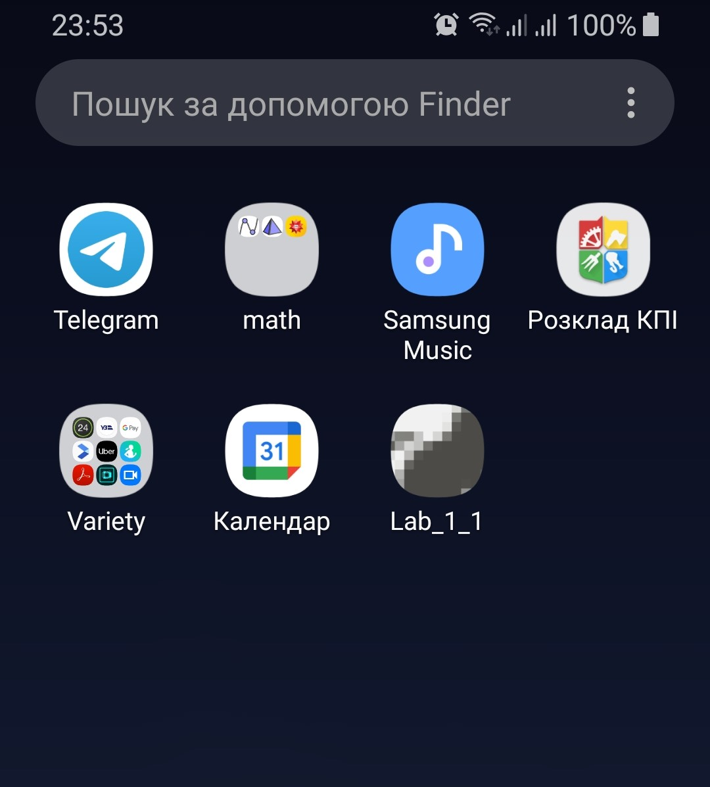

# Mobile Development labs

To run the app, install this ```.apk``` file:

[app_lab1_Hrona_Yurii_IO_83.apk](/Lab_1.1/app_lab1_Hrona_Yurii_IO_83.apk "app installation file")

## App icon:

<br />



## App content:

<br />


